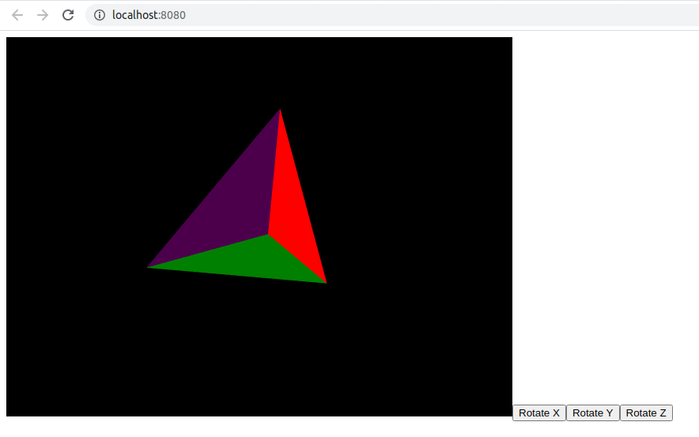

# Pyramid 3D

## Simple WebGL application made on Typescript

The application renders a colored pyramid into `canvas` html element. Each of 4 faces of pyramid has different color (cyan, green, red, blue). The pyramid can be rotated around X, Y or Z axis by pressing corresponding button ("Rotate X", "Rotate Y", "Rotate Z").



## Dependencies

- NodeJS;
- Npm;
- Web browser with WebGL 1.0 support.

## Build and Run

```
npm install
npm run build
```

Html with JS script is built in `dist` folder. Open `dist/index.html` in a web browser.

## Development

```
npm install
npm run start
```

Develompent server is run on 8080 port (http://localhost:8080)

## Implementation

The application is fully implemented on Typescript.

- [scenes/pyramid/pyramid-scene.ts](scenes/pyramid/pyramid-scene.ts) - rendering pyramid into GL context;
- [core/gl-context.ts](core/gl-context.ts) - getting GL context having html selector of `canvas` element;
- [core/gl-matrix.ts](core/gl-matrix.ts) - 4*4 matrix mathematics;
- [core/gl-shader.ts](core/gl-shader.ts) - initialization of shader programs;
- [tools/angles.ts](tools/angles.ts) - transformation angles from degrees to radians.

## License

This repository and the code inside it is licensed under the MIT License. Read [LICENSE](LICENSE) for more information.
